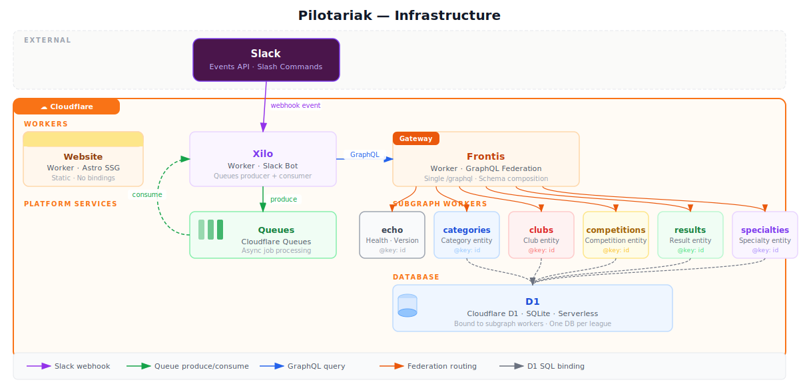

# Infrastructure Reference

Deployment topology for the Pilotariak website.



---

## Components

| Component | Technology | Role |
|-----------|-----------|------|
| Build output | `./dist/` | Static HTML/CSS/JS generated by `astro build` |
| Worker | Cloudflare Workers | Serves static assets from the edge |
| Asset binding | `wrangler.jsonc` `assets.directory` | Maps `./dist/` into the Worker |
| Edge network | Cloudflare CDN | Distributes assets globally |

## Configuration

**File:** `wrangler.jsonc`

```jsonc
{
  "name": "pilotariak-website",
  "compatibility_date": "2026-04-11",
  "assets": {
    "directory": "./dist"
  }
}
```

| Field | Value | Description |
|-------|-------|-------------|
| `name` | `pilotariak-website` | Worker name in Cloudflare dashboard |
| `compatibility_date` | `2026-04-11` | Workers runtime compatibility date |
| `assets.directory` | `./dist` | Path to static build output |

## URL structure

| Route | File served |
|-------|-------------|
| `/` | `dist/index.html` |
| `/frontis` | `dist/frontis/index.html` |
| `/kancha` | `dist/kancha/index.html` |
| `/xilo` | `dist/xilo/index.html` |
| `/fr/` | `dist/fr/index.html` |
| `/fr/frontis` | `dist/fr/frontis/index.html` |

## See Also

- [How to deploy to Cloudflare](../how-to/deploy-to-cloudflare.md)
- [Commands reference](commands.md)
- [Architecture explanation](../explanation/architecture.md)
